# End-to-End Encryption (E2EE) Implementation Guide

## Overview

This document explains how End-to-End Encryption is implemented in SyncPad, designed for developers who are new to cryptography concepts.

## What is End-to-End Encryption?

End-to-End Encryption (E2EE) ensures that only the sender and intended recipients can read the messages/content. Even the server storing the data cannot decrypt it because it doesn't have access to the decryption keys.

## Architecture Overview

Our E2EE implementation uses a **hybrid encryption** approach:

1. **RSA-OAEP (2048-bit)** for encrypting small data (AES keys)
2. **AES-GCM (256-bit)** for encrypting large data (document content)

```mermaid
graph TD
    A[User's Browser] --> B[RSA Key Pair Generation]
    B --> C[Public Key → Server]
    B --> D[Private Key → IndexedDB]

    E[Workspace Creation] --> F[AES Workspace Key Generation]
    F --> G[Encrypt AES Key with RSA Public Key]
    G --> H[Store Encrypted AES Key on Server]

    I[Content Creation] --> J[Encrypt Content with AES Key]
    J --> K[Store Encrypted Content on Server]
```



## Key Components

### 1. User Key Pair Management

**File**: `src/hooks/use-user-crypto-keypair.ts`

Each user gets an RSA key pair:

- **Public Key**: Stored on server, used by others to encrypt data for this user
- **Private Key**: Stored in browser's IndexedDB, never leaves the device

```typescript
// Generate RSA key pair for user
const { publicKey, privateKey } = await generateUserKeyPair();

// Store private key locally (never sent to server)
await setIndexedDbKey("privateKey", privateKey);

// Send public key to server
const jwk = await exportPublicKeyJwk(publicKey);
await updateUserPublicKey(jwk);
```

### 2. Workspace-Level Encryption

**File**: `src/hooks/use-workspace-encryption.ts`

Each workspace has its own AES encryption key:

- **Workspace Key**: AES-256 key used to encrypt all content in the workspace
- **Key Distribution**: Workspace key is encrypted with each member's RSA public key

```typescript
// Generate workspace AES key
const workspaceKey = await generateWorkspaceKey();

// Encrypt for each workspace member
for (const memberId of memberIds) {
  const memberPublicKey = await getMemberPublicKey(memberId);
  const encryptedKey = await rsaEncrypt(memberPublicKey, workspaceKey);
  await storeEncryptedKeyForUser(memberId, workspaceId, encryptedKey);
}
```

### 3. Content Encryption/Decryption

**File**: `src/hooks/use-periodic-save.ts`

Content is encrypted using the workspace AES key:

```typescript
// Encrypt content before saving
const iv = randomIv(); // 12-byte initialization vector
const encryptedContent = await aesEncrypt(workspaceKey, content, iv);
await saveToServer(encryptedContent);

// Decrypt content after loading
const decryptedContent = await aesDecrypt(workspaceKey, encryptedContent, iv);
```

## Database Schema

### `encryption_keys` Table

```sql
CREATE TABLE encryption_keys (
  id UUID PRIMARY KEY,
  user_id TEXT NOT NULL,
  workspace_id TEXT, -- For workspace-level keys
  page_id TEXT,      -- For page-level keys (legacy)
  key TEXT NOT NULL  -- Encrypted AES key (comma-separated bytes)
);
```

### `users` Table

```sql
-- Additional column for public key storage
ALTER TABLE users ADD COLUMN public_key_jwk JSONB;
```

## Workspace Access Models

### 1. Private Workspaces

- **Owner**: Has full access, manages encryption keys
- **Editors/Viewers**: Get encrypted workspace key via their RSA public key
- **Key Distribution**: When adding a user, their public key encrypts the workspace key

### 2. Public Workspaces (`any_user_can_view` / `any_user_can_edit`)

- **Security Trade-off**: Cannot provide true E2EE since anyone can access
- **Implementation**: Generate local-only AES keys for client-side encryption
- **Benefit**: Still protects against some server-side attacks

```typescript
// Public workspace handling
if (workspace.any_user_can_view || workspace.any_user_can_edit) {
  // Generate local-only key (not true E2EE)
  const localKey = await generateWorkspaceKey();
  await setIndexedDbKey(`workspaceKey:${workspaceId}`, localKey);
}
```

## Security Features

### 1. Key Storage

- **Private Keys**: Never leave the user's browser (stored in IndexedDB)
- **Public Keys**: Stored on server, used for key distribution
- **Workspace Keys**: Encrypted with RSA, distributed per user

### 2. Forward Secrecy

When a user is removed from a workspace:

```typescript
// Remove user's access
await keyService.deleteKeyByUserIdAndWorkspaceId(userId, workspaceId);

// Note: Existing content remains encrypted with old key
// For true forward secrecy, would need to re-encrypt all content
```

### 3. Data Flow

1. **Content Creation**:

   ```
   Raw Content → AES Encrypt → Server Storage
   ```

2. **Content Retrieval**:

   ```
   Server Storage → AES Decrypt → Raw Content
   ```

3. **User Addition**:
   ```
   Workspace Key → RSA Encrypt (User's Public Key) → Store for User
   ```

## API Endpoints

### Workspace Management

- `PATCH /api/workspaces/[workspaceId]` - Update workspace and manage key distribution
- `GET /api/keys/workspace/[workspaceId]` - Get user's encrypted workspace key

### Key Management

- `PATCH /api/users/[userId]` - Update user's public key
- `PATCH /api/workspaces/[workspaceId]/pages/[pageId]/grant` - Update encryption keys

## Implementation Files

### Core Crypto Functions

- `src/lib/crypto.ts` - Core cryptographic functions
- `src/types/encryption-key.ts` - TypeScript types for keys

### Services

- `src/lib/services/key-service.ts` - Database operations for encryption keys
- `src/lib/services/user-service.ts` - User management
- `src/lib/services/workspace-service.ts` - Workspace access control

### React Hooks

- `src/hooks/use-user-crypto-keypair.ts` - User key pair management
- `src/hooks/use-workspace-encryption.ts` - Workspace encryption
- `src/hooks/use-periodic-save.ts` - Auto-save with encryption

### API Routes

- `src/app/api/workspaces/[workspaceId]/route.ts` - Workspace management
- `src/app/api/keys/workspace/[workspaceId]/route.ts` - Key retrieval

## Security Considerations

### ✅ What We Protect Against

- **Server-side data breaches**: Content is encrypted, server can't read it
- **Network interception**: All content is encrypted in transit and at rest
- **Unauthorized access**: Only workspace members can decrypt content

### ⚠️ Limitations

- **Public workspaces**: Cannot provide true E2EE due to open access
- **Key compromise**: If private key is compromised, all user's data is at risk
- **Forward secrecy**: Removed users can still decrypt old content they had access to

### 🔒 Best Practices

- **Private key security**: Keys never leave the browser
- **Regular key rotation**: Consider implementing workspace key rotation
- **Access auditing**: Track who has access to what workspaces

## Development Setup

1. **Generate user keys** on first login
2. **Store private keys** in IndexedDB
3. **Send public keys** to server
4. **Generate workspace keys** when creating workspaces
5. **Distribute keys** when adding collaborators

## Testing Encryption

```typescript
// Test encryption/decryption flow
const testContent = "Hello, encrypted world!";
const workspaceKey = await generateWorkspaceKey();
const iv = randomIv();

// Encrypt
const encrypted = await aesEncrypt(
  workspaceKey,
  new TextEncoder().encode(testContent),
  iv
);

// Decrypt
const decrypted = await aesDecrypt(workspaceKey, encrypted, iv);
const result = new TextDecoder().decode(decrypted);

console.log(result === testContent); // Should be true
```

## Troubleshooting

### Common Issues

1. **"User does not have a public key set up"**

   - User hasn't completed key generation
   - Check `useUserCryptoKeypair` hook

2. **"No workspace key found"**

   - User doesn't have access to workspace
   - Workspace owner needs to add user

3. **Decryption failures**
   - Check if IV is correctly stored/retrieved
   - Verify key distribution was successful

### Debugging Tips

```typescript
// Check if user has keys
const privateKey = await getIndexedDbKey("privateKey");
console.log("Has private key:", !!privateKey);

// Check workspace key
const workspaceKey = await getIndexedDbKey(`workspaceKey:${workspaceId}`);
console.log("Has workspace key:", !!workspaceKey);
```

This implementation provides a solid foundation for E2EE while maintaining usability and performance.
